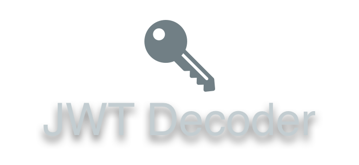

<p align="center"></p>

<p align="center">
<a href="https://packagist.org/packages/musa11971/php-jwt-decoder"></a>
<a href="https://github.com/musa11971/php-jwt-decoder/actions?query=workflow%3Arun-tests+branch%3Amaster"></a>
<a href="https://scrutinizer-ci.com/g/musa11971/php-jwt-decoder"></a>
<a href="https://packagist.org/packages/musa11971/php-jwt-decoder"></a>
</p>

<p align="center">
  <sup><em>lightweight and easy to use. what more could you want</em></sup>
</p>

# Easily decode JWT

This lightweight PHP library helps you decode and verify JSON Web Tokens easily.

```php
$payload = JWTDecoder::token($jwt)
                ->withKey($publicKey)
                ->decode();
```

## Installation

You can install the library via composer:

```bash
composer require musa11971/php-jwt-decoder
```

## Usage

### Basic decoding
Pass on your JWT and (public) key (e.g. PEM) as strings.
```php
$payload = JWTDecoder::token($jwt)
                ->withKey($key)
                ->decode();
```

### Decoding with multiple keys
You may have multiple potential keys, one of which is the correct one for the JWT. This library allows you to simply pass on all the keys, and it will try every key until the signature is verified.  
Do note that if none of the keys are correct, you will be met with an exception.
```php
$keys = [...]; // Array of keys

$payload = JWTDecoder::token($jwt)
                ->withKeys($keys)
                ->decode();
```

### Ignoring the token expiry time
By default, the library will check the token's expiry time ([exp](https://tools.ietf.org/html/rfc7519#section-4.1.4)) if it is present. However, if (for whatever reason) you wish to ignore the expiry time, you can use the following option. 
```php
$payload = JWTDecoder::token($jwt)
                ->withKey($key)
                ->ignoreExpiry()
                ->decode();
```

### Ignoring the token 'not valid before' time
Similarly to the `ignoreExpiry` option, you can also ignore the 'not valid before' time of the token ([nbf](https://tools.ietf.org/html/rfc7519#section-4.1.5)).
```php
$payload = JWTDecoder::token($jwt)
                ->withKey($key)
                ->ignoreNotValidBefore()
                ->decode();
```

### Working with the payload
The decoder always returns a `JWTPayload` instance. Use this object to access the data in the payload.  
  
**Check if payload has a value**
```php
$payload->has('username'); // true
$payload->has('date_of_birth'); // false
```

**Get a value from the payload**
```php
$payload->get('username'); // 'John'
```

**Convert a payload to an array**
```php
$payload->toArray();

/*
 * [
 *   'username'     => 'John',
 *   'email'        => 'john@example.com',
 *   'sub'          => '1234567890',
 *   'iat'          => 1516239022,
 *   'exp'          => 1516243210
 * ]
 */
```

### Testing

``` bash
composer test
```

## Contributing

Please see [CONTRIBUTING](CONTRIBUTING.md) for details.

### Security

If you discover any security related issues, please email mussesemou99@gmail.com instead of using the issue tracker.

## Credits

Credits go to [musa11971](https://github.com/musa11971) for creating and maintaining the library.  

Special thanks  
- .. to [all contributors](../../contributors) for contributing to the project.

## Support me

I am a full-time software engineering student and work on this library in my free time. If you find the library useful, please consider making a [donation](https://www.paypal.me/musa11971)! Every little bit helps. 💜

## License

The MIT License (MIT). Please see [License File](LICENSE.md) for more information.
